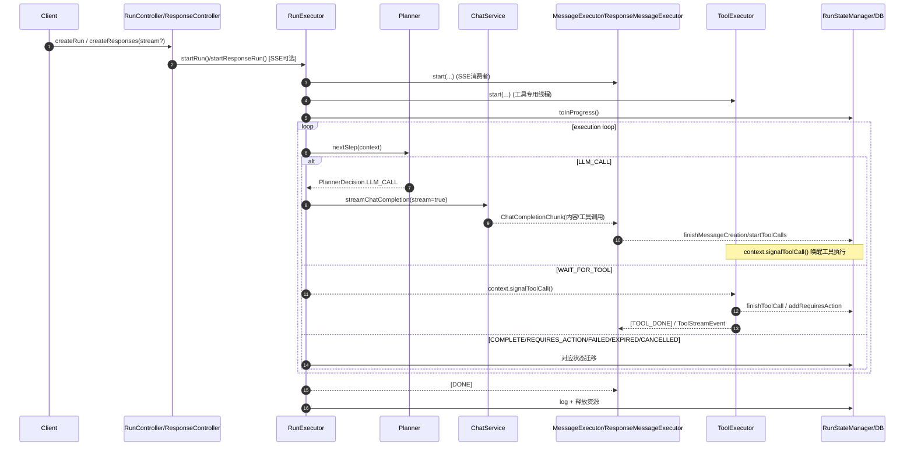
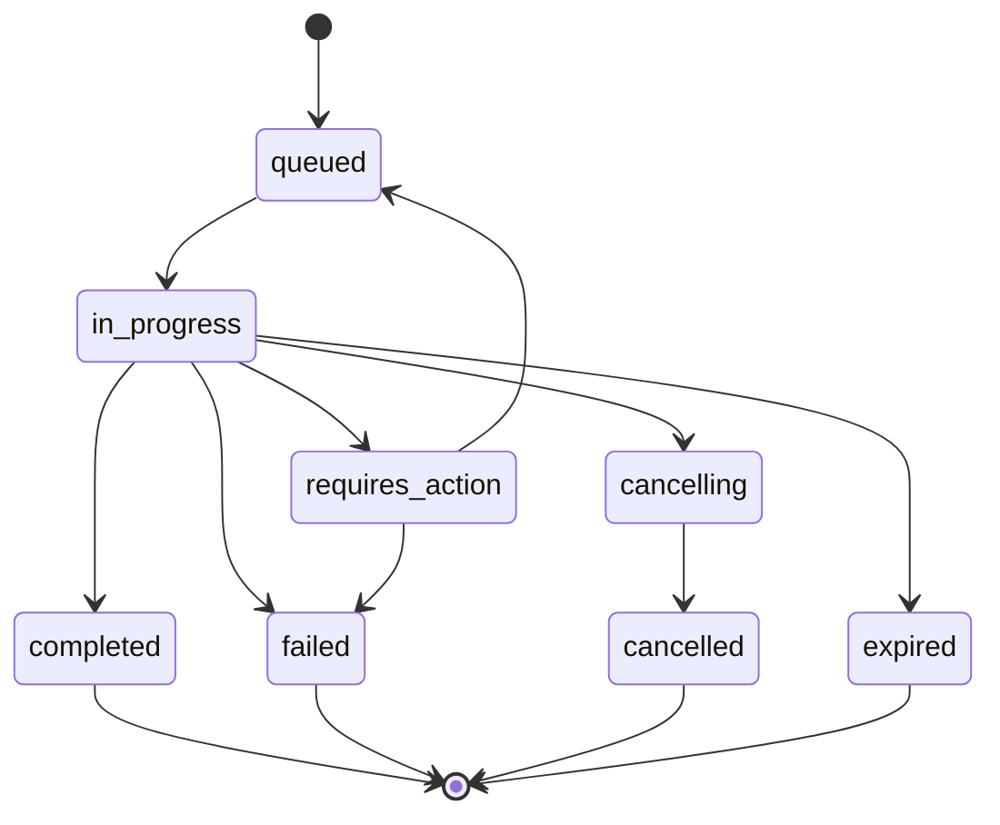
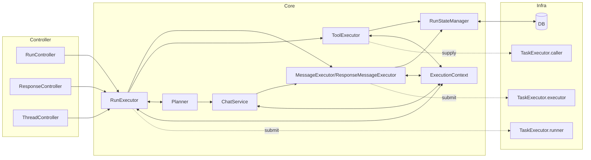

# 深入执行引擎：Run Executor的设计

> 执行引擎是整个系统的心脏。bella-assistants项目在兼容OpenAI Assistants API的基础上，设计了一套高度优化的执行引擎架构。本文将深入剖析Run Executor的全链路设计，揭示其如何通过精巧的分层架构、并发控制和性能优化，实现了高效、可靠的AI对话执行能力。

---

## 全链路生命周期

一次 Run 的端到端链路自上而下如下所示：

关键代码入口：
- 创建接口：`RunController.createRun()`、`ThreadController.createThreadAndRun()`、`ResponseController.createResponses()`。
- 执行入口：`RunExecutor.startRun()`/`startResponseRun()` → `executeRun()` → `executeLoop()`（文件：`api/src/main/java/com/ke/assistant/core/run/RunExecutor.java`）。
- 计划器：`Planner.nextStep()`（`core/plan/Planner.java`）。
- 模型流式：`ChatService.chat()`（`core/ai/ChatService.java`）。
- 工具执行：`ToolExecutor.run()/loop()`（`core/tools/ToolExecutor.java`）。
- 消息流式：`MessageExecutor` 与 `ResponseMessageExecutor`（`core/run/*.java`）。
- 状态持久化：`RunStateManager`（`core/run/RunStateManager.java`）。

---

## 执行状态机设计（queued → in_progress → requires_action → completed）

状态枚举与事件映射：`RunStatus`（`core/run/RunStatus.java`）。
- `QUEUED` → `IN_PROGRESS` → `REQUIRES_ACTION`/`COMPLETED`/`FAILED`/`CANCELLING` → `CANCELLED` 或 `EXPIRED`。
- 对应 SSE 事件：`StreamEvent.THREAD_RUN_*` / `THREAD_RUN_STEP_*`。

状态迁移落地：`RunStateManager` 负责 DB 加锁/校验与变更：
- `toInProgress()`：校验 `message_creation` 与 `run_step` 均为 `in_progress`，成功后缓存执行中的 `context`，并注册到 `ServiceMesh`（用于跨实例取消）。
- `startToolCalls()`：创建 `tool_calls` 类型的 `run_step` 为 `in_progress`，并 `context.signalToolCall()` 唤醒工具执行线程。
- `finishMessageCreation()/finishToolCall()`：落库 `usage`、`step_details`、错误信息等；当工具全部完成（或失败）后触发 `context.signalRunner()` 继续主循环。
- `toRequiresAction()/submitRequiredAction()`：当存在外部工具（无服务器端 Handler）时，构造 `RequiredAction` 并挂到 `run`；外部提交后将 `run` 返回到 `QUEUED` 以继续后续轮次。
- 终止态：`toCompleted()/toFailed()/toCanceled()/toExpired()`。

---

## 执行器的分层架构与协作

- **RunExecutor（主控制器）**：`RunExecutor.executeRun()` + `executeLoop()` 控制一次 Run 的生命周期与循环调度，选择消息执行器（`MessageExecutor` vs `ResponseMessageExecutor`），以及启动工具执行器（`ToolExecutor.start(...)`）。
- **Planner（规划执行器）**：`Planner.nextStep()` 负责：
  - 终止/异常/超时/外部输入等快速分支；
  - 构建聊天上下文 `buildChatMessages()` 与工具列表 `buildChatTools()`；
  - 决策 `LLM_CALL` 或 `WAIT_FOR_TOOL`/`COMPLETE`。
- **AIExecutor（模型调用执行器）**：由 `ChatService.chat()` 承担，组装 `ChatCompletionRequest` 并启用 `stream=true`，将 `ChatCompletionChunk` 逐条 `context.publish(...)` 给消息执行器消费；内建带指数风格的有限重试逻辑。
- **ToolExecutor（工具执行器）**：独立线程等待 `context.toolCallAwait()`，被唤醒后并发执行可服务端处理的工具；必要时通过 `ToolOutputChannel.start(context)` 开启工具输出串行通道。
- **MessageExecutor/ResponseMessageExecutor（消息处理执行器）**：
  - Assistant API 路径：`MessageExecutor` 将 Token/推理流与工具调用事件转换为 OpenAI Assistants SSE 事件（`THREAD_MESSAGE_DELTA`、`THREAD_RUN_STEP_DELTA` 等），并负责在 `[LLM_DONE]`/`[TOOL_DONE]` 时调用 `RunStateManager` 收尾。
  - Response API 路径：`ResponseMessageExecutor` 将 Token/推理/函数调用/工具输出映射为 Response API 的 `BaseStreamEvent` 序列，使用 `sequenceNumber`/`outputIndex`/`itemId` 明确顺序与边界，并在运行停止时汇总 `Response` 返回。
- **ExecutionContext（协作枢纽）**：跨执行器共享的状态与同步原语（`ReentrantLock + Condition`），包含：
  - 发送队列 `senderQueue`、工具任务 `currentToolTasks`、结果 `currentToolResults`、元数据 `currentMetaData`；
  - 条件等待/唤醒：`runnerAwait()/signalRunner()`、`toolCallAwait()/signalToolCall()`；
  - 输出串行标识：`currentOutputToolCallId`；
  - 运行参数、文件映射、模型特性与配额统计等。
- **RunStateManager（状态与持久化）**：以 DB 为真值源，处理 `run` 与 `run_step` 的状态迁移、`usage`、`step_details`、`required_action` 与 `message` 内容的最终一致性更新。

---

## 工具并发执行的顺序保证

### 工具依赖与调度

- 工具产生：LLM 流式返回 `ChatToolCall` 时由 `MessageExecutor/ResponseMessageExecutor` 调用 `ExecutionContext.addToolCallTask()` 收集，必要时生成 `currentToolCallStepId` 并发出 `THREAD_RUN_STEP_CREATED/DELTA`。
- 工具分类：`ToolExecutor` 将工具分为两类：
  - 服务器端可执行（存在 `ToolHandler`，且非 `definitionHandler`）→ 并发执行。
  - 不可在服务端执行（`definitionHandler` (比如 response api的custom tool和local shell tool) 或无 Handler）→ 汇总到 `RequiredAction`，返回客户端提交。

### 并行工具组与异步编排

- 编排核心：`ToolExecutor.loop()` 将一批 `ChatToolCall` 转换为 `ToolCall`，对有 Handler 的任务使用 `TaskExecutor.supplyCaller(...)` 提交到 `caller` 线程池并返回 `CompletableFuture`；`CompletableFuture.allOf(...).join()` 等待本批内部工具全部完成。
- 结果聚合：每个工具完成后调用 `RunStateManager.finishToolCall()` 将 `ToolCall` 附加到当前 `run_step.step_details.tool_calls`，并在全部完成后推进 `run_step` 为 `completed`（或 `failed`）。

### 执行顺序与结果顺序的解耦

- 执行并发：多个工具在 `caller` 池中并发执行，互不阻塞。
- 输出串行：为保证客户端观感与一致性，输出通过 `ToolOutputChannel` 串行化：
  - `ExecutionContext.currentOutputToolCallId` 指定当前允许输出的 `tool_call_id`。
  - `ToolOutputChannel`（`core/tools/ToolOutputChannel.java`）在内部缓存不同 `tool_call_id` 的产出，按“当前指定 ID 优先，其它等待”的策略，逐条 `context.publish(...)`。
  - 工具完成后，`MessageExecutor` 消费 `[TOOL_DONE]` 并执行 `context.finishToolCallOutput()` 清空当前输出 ID，释放下一个工具的输出资格。
- Response API 模式：`ResponseMessageExecutor` 将工具输出转换为 `BaseStreamEvent` 序列，使用全局 `sequenceNumber`、`outputIndex` 与 `itemId` 显式标注顺序，同样与真实执行完成先后解耦。

### 结果聚合与排序

- 聚合容器：`ExecutionContext.currentToolResults`（`CopyOnWriteArrayList`）。
- 持久化：`RunStateManager.finishToolCall()` 以当前收集顺序写入 `StepDetails.toolCalls` 后持久化。
- 备注：当前实现未对工具结果按 `index` 或 `id` 显式排序；如需更稳定的顺序，可在写入 `StepDetails` 前按 `ToolCall.index` 排序（建议见文末）。

---

## 性能优化技术点

- **线程池隔离（`core/TaskExecutor.java`）**：
  - `runner`（Run 主循环）100–500，`SynchronousQueue`，避免排队滞留，满时拒绝, 请求失败；
  - `executor`（消息/工具执行器）200–1100，`SynchronousQueue`，隔离与削峰，满时拒绝, 请求失败；
  - `caller`（工具实际执行与输出发送）100–1000，`ArrayBlockingQueue(1000, fair=true)`，避免同批工具出现一个执行完成，另一个还在等待待情况。且通过公平队列确保执行过程中的工具执行顺序，可在线程池排队时减少client端的响应延迟。
  - `RepoContext` 跨线程透传，提交即捕获、执行即附着，保证 DB 上下文一致性。
- **流式传输**：
  - Assistant API：`MessageExecutor.send*()` 将增量内容/推理/图片等封装为 `THREAD_MESSAGE_DELTA` 等 SSE 事件，首包通过 `sendFirstMessage()` 补发 `thread.run.step.created/in_progress` 与空内容 `thread.message.*` 的就绪事件。
  - Response API：`ResponseMessageExecutor` 精准维护 `sequenceNumber/outputIndex/contentIndex`，保证事件边界与顺序确定性；最终收敛为 `ResponseCompletedEvent/Failed/Incomplete`。
- **可靠性**：
  - LLM 调用重试：`ChatService.tryStreamChat()` 对 499/429/5xx（非 503）开启有限重试；
  - 过期/最大步数：`AssistantProperties` 注入到 `ExecutionContext.expiredAt/maxSteps`，由 `Planner` 快速裁决 `EXPIRED` 或 `ERROR`；
  - 取消：`RunStateManager` 将运行中 `context` 缓存到 `processingCache`，通过 `ServiceMesh` 事件触发 `ExecutionContext.cancel()`。

---

## 关键代码索引（便于交叉阅读）

- `core/run/RunExecutor.java`：主循环、执行器启动、上下文构建。
- `core/plan/Planner.java`：计划决策、上下文构建、工具清单。
- `core/ai/ChatService.java`：LLM 流式与重试。
- `core/run/MessageExecutor.java`：Assistant API SSE 输出、工具事件转发。
- `core/run/ResponseMessageExecutor.java`：Response API 流式事件编排。
- `core/tools/ToolExecutor.java`：工具并发、结果聚合与 RequiredAction。
- `core/tools/ToolOutputChannel.java`：工具输出串行通道。
- `core/run/ExecutionContext.java`：共享状态与同步原语。
- `core/run/RunStateManager.java`：状态机与 DB 落地。
- `core/TaskExecutor.java`：线程池隔离与 `RepoContext` 透传。

---

## 总结

当前实现以 `RunExecutor` 为中枢，借助 `Planner` 决策与 `ExecutionContext` 协调，将“模型流式”“工具并发”“SSE 输出”“DB 状态机”解耦到独立执行器与线程池中，实现了高并发下的可控顺序与稳定落库。未来可在资源分级限流与观测性方面进一步增强。
