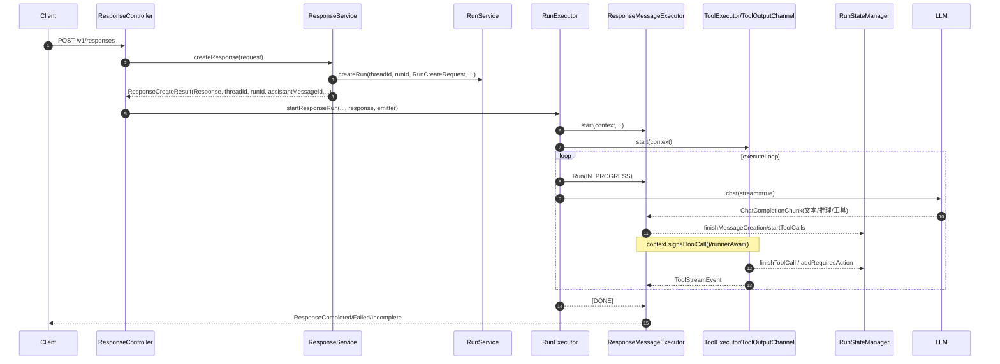

# 最小增量实现 Responses API

> 以最小增量复用 Run/Thread/Tool/Message 全链路，构建 Response API 的轻量化执行与流式协议适配。

---

## 架构复用的设计理念

- **共性分析（以 Run 为中心）**
  - 两条路径本质一致：均是“规划 → 模型流式 → 工具并发 → 状态机落库/返回”。
  - 共享核心：`RunExecutor.executeRun()` + `executeLoop()`、`Planner.nextStep()`、`ChatService.chat()`、`ToolExecutor`、`RunStateManager`、`ExecutionContext`、线程池隔离（`TaskExecutor`）。
  - 差异只在“消息编排与协议映射”层：Assistant 用 `MessageExecutor`→ Assistants SSE；Responses 用 `ResponseMessageExecutor`→ Responses SSE。

- **核心组件抽象与泛化**
  - `ExecutionContext` 统一线程内状态与同步（队列、锁、条件变量、工具任务/结果、SSE 输出队列、模型能力、文件映射等）。
  - `RunExecutor` 统一调度骨架（模板方法式骨架）：启动消息执行器与工具执行器 → 进入计划/执行循环 → 统一收尾。
  - `ToolExecutor`/`ToolOutputChannel` 统一工具并发与输出串行化机制。
  - `RunStateManager` 统一 Run/Step 状态迁移与持久化。

- **设计模式**
  - **Template Method**：`RunExecutor.executeRun()` 定义通用执行骨架，仅在“选择消息执行器”处分流。
  - **Adapter**：
    - `ResponseService.createResponse()` + `ResponseUtils.convertToRunRequest()` 将 `CreateResponseRequest` 适配为 `RunCreateRequest`（无 Assistant 场景）。
    - `ResponseMessageExecutor` 将 `ChatCompletionChunk`/工具输出适配为 Responses 的 `BaseStreamEvent` 序列。
  - **Strategy**：`Planner` 决策执行步；`ToolHandler` 多工具实现；`ToolChoice` 与“并行工具”开关来自元数据策略。
  - **Observer/Producer-Consumer**：`ExecutionContext.senderQueue` 串联 Run 主循环、LLM 流、工具流与 SSE 发送线程。
  - **Bulkhead（隔离栅）**：`TaskExecutor` 多线程池隔离 Runner/Executor/Caller，避免相互干扰（见 `api/run-executor-design.md`）。

---

## 共享组件的设计

- **Thread 管理器的双模式支持（Store/Non-Store）**
  - 控制面：`ResponseController.createResponses()` 对 `store=false` 激活 `RepoContext` 非持久模式；`ResponseIdMappingRepo` 等 Repo 感知并走内存态。
  - 数据面：`ResponseService.confirmThreadAndRun()` 支持三路：显式 `conversation`、基于 `previous_response_id`、或新建 `thread`（`ThreadService.createThread()`）。
  - 分支复用：如果 `previous_response_id` 已被使用，`checkAndStore()` 走写锁并调用 `ThreadService.forkThreadBeforeTargetRun()` 在目标 run 的 assistant 消息“之前”分叉，且可将该 run 的工具调用消息对（tool_call/tool_result）一并织入，保证对话延续性与顺序性。

- **Message 处理 pipeline 的复用**
  - 上游一致：`ChatService.chat(context)` 将模型流式增量与工具调用增量都投递到 `ExecutionContext.senderQueue`。
  - 中游分流：Assistant 用 `MessageExecutor`，Responses 用 `ResponseMessageExecutor`。两者都调用 `RunStateManager.finishMessageCreation()`、`startToolCalls()`、`finishToolCall()` 等，共享消息/步骤的最终一致性路径。
  - 底层一致：`MessageService` 承担消息读写；`RunService` 生成 `message_creation`/`tool_calls` 步骤并维护工具相关元数据。

- **Run 执行引擎的适配层**
  - `RunExecutor.startResponseRun()` 在通用 `ExecutionContext` 上打标 `context.setResponse(response)`，从而在 `executeRun()` 中选择 `ResponseMessageExecutor.start(...)`。
  - `RunExecutor.buildExecutionContext()` 完全复用 Assistant 路径：装载 Run/Step/Tools/Files/ModelFeatures，并发布首包（`Run`/`Thread` 或 `ResumeMessage`）。

- **工具系统的统一调用接口**
  - `ToolExecutor.start(...)` 注册服务端可执行工具（`ToolFetcher.getToolHandler()`），统一把 LLM 的 `ChatToolCall` 转 `ToolCall` 并并发执行。
  - 输出串行化：`ToolOutputChannel` 基于 `ExecutionContext.currentOutputToolCallId` 将多工具并行执行的产物按“一个工具一个时间窗口”的方式串行发布；Responses 路径中，`ResponseMessageExecutor` 再把这些输出映射为 `OutputItemAdded/Done`、`FunctionCallArgumentsDelta/Done` 等事件并维持全局 `sequenceNumber/outputIndex/contentIndex`。

---

## 差异化处理策略

- **previous_response_id 专属语义**
  - 解析与继承：`ResponseService.confirmThreadAndRun()` 通过 `ResponseIdMappingRepo.findByResponseId()` 找到上一轮 run，继承其 `tools`（作为“继承工具”打标），并确定 `threadId/previousRunId`。
  - 顺序与原子性：`checkFirstMessage(...)` 会在首条用户输入前补入必要的“上一轮消息边界”（例如未提交的工具调用或上一条 assistant 文本），并用 `MessageUtils.checkPre()` 校验 `user/assistant/tool` 邻接合法性，避免对话断裂。
  - 并发与幂等：`checkAndStore(...)` 以 `previous_response_id` 为写锁键，若该 previous 已被使用则自动分叉新 thread（见上文“分支复用”）。

- **无 Assistant 模式（按请求即时配置）**
  - 适配：`ResponseUtils.convertToRunRequest()` 将 `CreateResponseRequest` 转为 `RunCreateRequest`，不依赖 `assistant_id`，模型/指令/工具/裁剪/推理等均来自请求；`MetaConstants.RESPONSE_ID/STORE/PARALLEL_TOOL_CALLS/BACKGROUND` 等写入 `run.metadata` 控制后续行为。
  - 落地：`RunService.doCreateRun()` 检测 `RESPONSE_ID` 即走“无 Assistant”分支，仍复用统一的 Run/Step/Tool 创建逻辑，保证与 Assistant 路径一致的稳定性与可观测性。

- **不同响应协议的处理**
  - Assistant：`MessageExecutor` 输出 OpenAI Assistants 系列事件（`THREAD_MESSAGE_DELTA` 等），在 `[LLM_DONE]/[TOOL_DONE]` 时统一收尾。
  - Responses：`ResponseMessageExecutor` 输出 `ResponseCreated/InProgress/Completed/Failed/Incomplete` 及细粒度内容/工具事件：
    - 文本：`OutputItemAdded` → `OutputTextDelta` → `OutputTextDone` → `OutputItemDone`。
    - 推理：`ReasoningSummaryPartAdded` → `ReasoningSummaryTextDelta/Done`。
    - 函数调用：`OutputItemAdded(FunctionToolCall)` → `FunctionCallArgumentsDelta/Done`。
    - 工具输出：从 `ToolOutputChannel` 接收 `ToolStreamEvent`，据 `currentOutputToolCallId` 生成 `itemId` 并与 `outputIndex` 对齐，完成后 `context.finishToolCallOutput()` 释放下一个工具的输出权。

- **轻量级上下文（Non-Store）**
  - 开关：`ResponseController.createResponses()` 对 `store=false` 激活 `RepoContext`，对应 Repo（如 `ResponseIdMappingRepo`）走内存实现；`ExecutionContext.isStore()` 也基于 `run.metadata.store` 控制消息是否落库。
  - 体验：在不持久化的场景下，仍可完整获得 Responses 流式事件与最终聚合结果（`context.blockingGetResult(...)`）。

---

## 时序与协作（Responses 路径）

---

## 关键代码索引

- **控制层**
  - `api/src/main/java/com/ke/assistant/controller/ResponseController.java`
- **业务编排**
  - `api/src/main/java/com/ke/assistant/service/ResponseService.java`
  - `api/src/main/java/com/ke/assistant/service/RunService.java`
  - `api/src/main/java/com/ke/assistant/service/ThreadService.java`
  - `api/src/main/java/com/ke/assistant/db/repo/ResponseIdMappingRepo.java`
- **执行与消息**
  - `api/src/main/java/com/ke/assistant/core/run/RunExecutor.java`
  - `api/src/main/java/com/ke/assistant/core/run/ExecutionContext.java`
  - `api/src/main/java/com/ke/assistant/core/run/ResponseMessageExecutor.java`
  - `api/src/main/java/com/ke/assistant/core/run/MessageExecutor.java`（Assistant）
- **工具体系**
  - `api/src/main/java/com/ke/assistant/core/tools/ToolExecutor.java`
  - `api/src/main/java/com/ke/assistant/core/tools/ToolOutputChannel.java`
  - `api/src/main/java/com/ke/assistant/core/tools/ToolHandler.java` 与各 `handlers/*`
- **协议与适配**
  - `api/src/main/java/com/ke/assistant/util/ResponseUtils.java`
  - `api/run-executor-design.md`、`api/thread-concurrent-run-ordering.md`

---

## 小结

Responses API 以“适配层 + 协议映射”的最小改造复用 Assistant 执行栈：
- Run/Tool/State/Context 保持完全一致，继承其稳定性与并发能力；
- 通过 `ResponseMessageExecutor` 与 `ResponseUtils` 实现协议与输入的定制化；
- 借助 `previous_response_id` 的分支机制与 Store/Non-Store 双模式，既能延续复杂对话，也能满足轻量与隐私需求。
