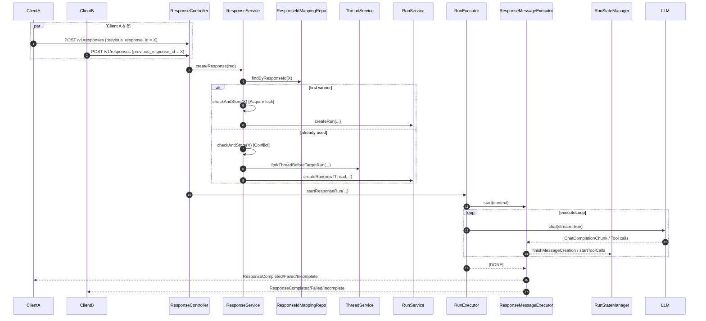
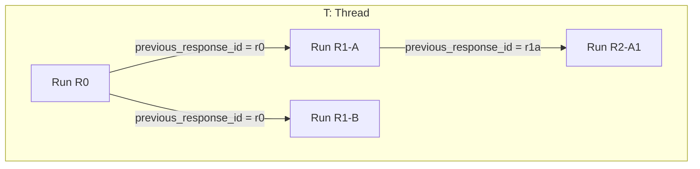

# 对话树：response的多路径执行

> 在同一对话分叉点上安全地并发创建多条路径（分支），保证每条路径的顺序一致性、流式输出与最终一致收敛，同时最小化复制成本。

---

## 设计目标与约束

- **并发分支**：允许多个请求基于同一 `previous_response_id` 同时触发，各自获得独立的分支路径。
- **顺序一致性**：每条分支内部严格保持消息相邻性与工具调用的时序合法性（见 `MessageUtils` 校验）。
- **轻量复制**：分支创建尽量采用“引用+按需增量写入”的策略，以实现 Copy-on-Write（COW）语义，降低存储与复制开销。
- **与执行栈解耦**：分支仅影响“对话/消息编排”，执行主循环仍复用 `RunExecutor.executeRun()`、`ToolExecutor`、`RunStateManager` 等组件。
- **协议无关**：同时适配 Assistants 与 Responses 协议，Responses 通过 `ResponseMessageExecutor` 映射事件序列。

---

## 分支对话的数据结构设计

- **树形结构的对话历史管理**
  - 逻辑上将一次对话视为一棵树：根为初始 `thread`，分支节点由基于某个 `previous_response_id` 的请求触发。
  - 分支节点的“父指针”由“上一轮运行（run）”隐式确定，从而形成可回溯的多路径对话轨迹。
  - 在触发分叉时，会将RunStep的执行过程转化为消息数据，fork到新的thread的message中，为了便于查询，物理存储相当于一颗新的树，逻辑上是同一棵的不同分支。

- **previous_response_id 的索引与解析**
  - 通过 `ResponseIdMappingRepo` 将 `previous_response_id → {threadId, runId}` 进行定位。
  - 写入 `ResponseIdMappingRepo` 通过对 `previous_response_id` 加分布式锁，保证串行写入。
  - `ResponseService.confirmThreadAndRun(...)` 基于该映射确认目标 `thread` 与上一轮 `run`，并继承必要上下文（如可用工具）。

- **分支元数据的存储与继承**
  - 分支来源、父子关联、工具等元数据统一写入 `run` 的元数据与关联表，供执行时与观测面复用。
  - 在 Responses 路径中，可继承的工具（通常是用于处理多模态消息数据的工具）会被标注用于后续工具选择。

---

## 多路径并发执行

- **并发控制与幂等**
  - `ResponseService.checkAndStore(previous_response_id)` 以 `previous_response_id` 为写锁键，确保并发请求对同一前序响应的处理具备原子性。
  - 若该 `previous_response_id` 已被占用，则触发分叉：`ThreadService.forkThreadBeforeTargetRun(...)` 基于目标 run 的“assistant 消息之前”进行分支，必要时将其工具调用消息对（`tool_call/tool_result`）一并织入，保证对话的延续性与顺序性。

- **消息相邻性与合法性校验**
  - 每次请求，校验全部消息的合法性
  - 与之前之前会话最后一条消息拼接校验

- **隔离与共享的平衡**
  - 共享：模型能力、工具注册、历史消息的只读引用、文件映射、线程池策略（见 `TaskExecutor` 的 Bulkhead 隔离）。
  - 隔离：分支上的新增消息与工具调用结果、输出序列号、SSE 事件上下文。

---

## 执行与流式协作（以 Responses 为例）



---

## 拓扑与数据关系（对话树）



- 每条边表示“以该 run 的 `response_id` 作为 `previous_response_id` 触发的新路径”。
- 分支节点共享对 R0 的历史视图，但在各自路径上独立追加消息与工具调用结果。

---

## 应用场景与价值

- **A/B 测试对话策略**：基于同一分叉点，试验不同提示词、工具选择或推理开关，在线对比效果。
- **多轮对话的回溯与重试**：从关键节点回退并尝试不同路径，降低错误传播成本。
- **探索式对话**：在不打断主路径的前提下分叉尝试，完成后再回到主线。

---

## 关键代码索引

- 控制层
  - `api/src/main/java/com/ke/assistant/controller/ResponseController.java`
- 业务与分支
  - `api/src/main/java/com/ke/assistant/service/ResponseService.java`（`confirmThreadAndRun`、`checkAndStore`、`checkFirstMessage`）
  - `api/src/main/java/com/ke/assistant/service/ThreadService.java`（`forkThreadBeforeTargetRun(...)`）
  - `api/src/main/java/com/ke/assistant/db/repo/ResponseIdMappingRepo.java`
  - `api/src/main/java/com/ke/assistant/util/MessageUtils.java`
- 执行与一致性
  - `api/src/main/java/com/ke/assistant/core/run/RunExecutor.java`
  - `api/src/main/java/com/ke/assistant/core/run/ExecutionContext.java`
  - `api/src/main/java/com/ke/assistant/core/run/RunStateManager.java`
  - `api/src/main/java/com/ke/assistant/core/run/ResponseMessageExecutor.java`

---

## API 使用示例（Responses）

```json
POST /v1/responses
{
  "input": [
    {"role": "user", "content": [{"type": "text", "text": "在这里开始分叉后的提问"}]}
  ],
  "previous_response_id": "resp_1234567890",
  "store": true,
  "metadata": {"parallel_tool_calls": true}
}
```

- 若 `resp_1234567890` 首次被使用，本次请求直接续接；否则自动分叉再续接。
- SSE 输出遵循 Responses 事件序列，文本/推理/函数与工具输出按 `sequenceNumber/outputIndex/contentIndex` 严格编号。

---

## 边界与故障恢复

- **并发冲突**：以 `previous_response_id` 为锁键，`checkAndStore(...)` 保证原子性与幂等。
- **非法相邻**：`MessageUtils.checkPre(...)` 拦截并返回可诊断错误。
- **工具一致性**：分支继承工具清单，`ToolExecutor` 统一并发调用与输出串行化，避免乱序注入。
- **Non-Store 模式**：在 `store=false` 时走内存态 Repo（`RepoContext` 激活），保留完整流式体验与最终聚合结果。

---

## 小结

- 通过“锁+分叉”的最小增量方案，复用既有 Run/Tool/State/Context 执行栈，实现同一 `previous_response_id` 的多路径并行执行。
- 分支以 COW 语义最小化复制成本，同时在消息/工具层面维持顺序一致性与可观测性。
