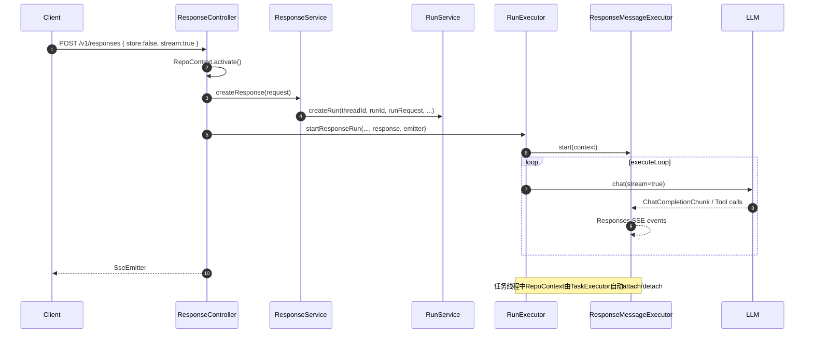

# 轻量级：非Store模式设计与实现

> 在不落库的前提下，完整复用 Run/Tool/State/Context 执行栈与流式协议，通过线程本地内存态 Repo 提供“即开即用、请求内可观测”的轻量体验。

---

## 设计目标

- **零持久**：请求内不向数据库写入对话、Run、Step、工具记录。
- **端到端流式**：支持 SSE 流、并在阻塞模式下返回完整聚合结果。
- **最小逻辑入侵**：仅在 Repo 层切换到内存实现；执行主干保持一致。
- **可并发**：保留多线程执行、工具并行与输出串行化能力。
- **安全边界**：禁止与历史依赖耦合的能力（如 previous_response_id、conversation）。

---

## 开启与生命周期

- **入口开关**：`ResponseController.createResponses()` 中，当 `request.store == false` 时调用 `RepoContext.activate()` 启用非Store模式。
  - 代码：`api/src/main/java/com/ke/assistant/controller/ResponseController.java`
  - 关键逻辑：
    - `boolean nonStore = Boolean.FALSE.equals(request.getStore());`
    - `if (nonStore) RepoContext.activate();`
    - 在 `finally` 中 `RepoContext.detach();`

- **跨线程传播**：`TaskExecutor` 提交任务时捕获线程本地的 `RepoContext.State` 快照，并在执行线程 `attach/detach`，保证 runner/executor/caller 三个线程池的一致上下文。
  - 代码：`api/src/main/java/com/ke/assistant/core/TaskExecutor.java`
  - 方法：`addRunner/addExecutor/addToolSender/supplyCaller` → `wrapWithRepoContext(...)`

- **生命周期**：
  - `RepoContext` 为 ThreadLocal 容器；在请求发起线程激活，提交到执行线程后携带快照；当所有执行线程结束时自动 `detach`，内存数据随之释放。
  - 非Store模式下的实体仅在本次执行的相关线程内可见，不对后续请求可见。

---

## 数据平面：内存态 RepoContext

- **存储结构**：`RepoContext.Store` 提供内存 Map 作为“轻量数据库”。
  - 代码：`api/src/main/java/com/ke/assistant/db/context/RepoContext.java`
  - 维护实体：`threads/messages/runs/runSteps/runTools/responseIdMappings/threadFiles`。
  - 提供轻量查询：按时间排序、游标分页、范围筛选等常用方法。

- **Repo 选择逻辑**：各 Repo 通过 `BaseRepo.isNoStoreMode()` 判定是否走内存态。
  - 代码：`api/src/main/java/com/ke/assistant/db/repo/BaseRepo.java`
  - 示例：
    - `MessageRepo.findById(...)` 在非Store时调用 `getContextStore().findMessageById(...)`；
    - `ResponseIdMappingRepo.findByResponseId(...)`、`findByPreviousResponseId(...)` 同理。

---

## 协议与执行：与 Store 模式保持一致

- **执行主干**：完全复用 `RunExecutor.executeRun()` 的规划/执行循环、工具并行与消息流转。
  - 代码：`api/src/main/java/com/ke/assistant/core/run/RunExecutor.java`
  - 组件：`Planner`、`ChatService`、`ToolExecutor`、`RunStateManager`、`ExecutionContext`。

- **Responses 流式映射**：`ResponseMessageExecutor` 负责将 ChatCompletion 增量与工具输出映射为 Responses SSE 事件与最终 `Response` 聚合对象。
  - 代码：`api/src/main/java/com/ke/assistant/core/run/ResponseMessageExecutor.java`

- **是否落库标识**：
  - `ResponseUtils.convertToRunRequest(...)` 将 `request.store` 写入 `run.metadata[STORE]`，并设置 `saveMessage`（供消息落库策略使用）。
    - 代码：`api/src/main/java/com/ke/assistant/util/ResponseUtils.java`
  - `ExecutionContext.isStore()` 基于 `run.metadata[STORE]` 判定（默认 true）。
    - 代码：`api/src/main/java/com/ke/assistant/core/run/ExecutionContext.java`

- **additional_messages 策略**：非Store时，`RunService.doCreateRun(...)` 在创建 additional messages 时传入 `hidden = (Boolean.FALSE == request.getSaveMessage())`，实现“请求内可见、对外不暴露”。
  - 代码：`api/src/main/java/com/ke/assistant/service/RunService.java`

---

## 非Store请求时序



---

## 约束与边界

- **历史依赖禁用**：非Store模式下不支持历史依赖型能力：
  - `previous_response_id`、`conversation` 与 `store:false` 互斥（参数校验在 `ResponseService.createResponse(...)`）。
- **查询限制**：请求完成后，内存态数据随线程结束释放；因此不保证 `GET /v1/responses/{id}` 等查询可用。
- **后台执行**：`background:true` + 非Store 无法在事后拉取结果；如需结果，请使用 `stream:true` 或阻塞模式（默认，在 `stream:false && background:false`）。
- **持久化副作用**：所有写操作仅作用于 `RepoContext.Store`，不影响数据库。

---

## 资源与性能

- **内存占用**：数据仅在执行线程生命周期内常驻；无额外 LRU/持久化策略（由生命周期自然回收）。
- **吞吐与隔离**：保留 Bulkhead 线程池隔离：
  - Runner：`bella-runner-*`
  - Executor：`bella-executor-*`
  - Caller（工具执行/发送）：`bella-caller-*`
---

## 示例请求

- **流式非Store**（推荐）：
```json
{
  "model": "gpt-5-nano",
  "input": "请用100字总结这个话题",
  "store": false,
  "stream": true
}
```

- **阻塞非Store**（返回聚合 `Response` 对象）：
```json
{
  "model": "gpt-5-nano",
  "input": "解释刚才的三个要点",
  "store": false,
  "stream": false,
  "background": false
}
```

---

## 关键代码索引

- 控制层
  - `api/src/main/java/com/ke/assistant/controller/ResponseController.java`（启用/关闭 RepoContext；SSE/阻塞/后台返回策略）
- 执行与消息
  - `api/src/main/java/com/ke/assistant/core/run/RunExecutor.java`
  - `api/src/main/java/com/ke/assistant/core/run/ExecutionContext.java`
  - `api/src/main/java/com/ke/assistant/core/run/ResponseMessageExecutor.java`
  - `api/src/main/java/com/ke/assistant/core/TaskExecutor.java`
- Repo 与数据
  - `api/src/main/java/com/ke/assistant/db/context/RepoContext.java`
  - `api/src/main/java/com/ke/assistant/db/repo/BaseRepo.java`
  - `api/src/main/java/com/ke/assistant/db/repo/MessageRepo.java`
  - `api/src/main/java/com/ke/assistant/db/repo/ResponseIdMappingRepo.java`
- 协议与适配
  - `api/src/main/java/com/ke/assistant/util/ResponseUtils.java`
  - `api/src/main/java/com/ke/assistant/service/RunService.java`
  - `api/src/main/java/com/ke/assistant/service/MessageService.java`

---

## 小结

- 非Store模式通过 `RepoContext` 将所有数据操作限定在请求生命周期内，避免落库与后续可见性。
- 主执行栈（规划/流式/工具并行/状态机）零改动复用，结合线程池隔离保持稳定吞吐。
- 建议与 Responses 流式使用，或阻塞获取聚合结果；避免与历史依赖、后台执行等“事后查询”场景搭配。
