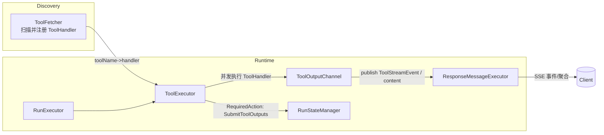
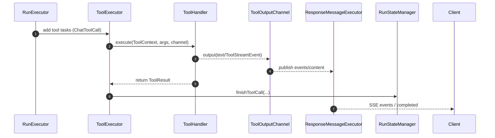
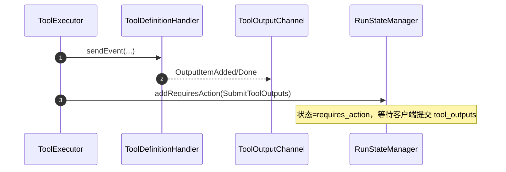

# 工具扩展：工具插件系统深度剖析

> 面向“可插拔、可并发、可流式”的工具系统。以统一的处理器接口和事件协议为核心，结合自动发现与上下文注入，支撑从内置工具到自定义定义类（definition-only）的多形态工具。

---

## 设计目标与原则

- **统一接口**：对内以 `ToolHandler` 为契约，对外兼容 Assistant/Responses 的工具协议与流式事件。
- **插件化发现**：基于 Spring 扫描与注册，零侵入纳管新工具实现。
- **并发安全**：工具并发执行，输出串行呈现，避免多路输出的竞争与乱序。
- **按需执行**：支持“定义类工具（definition-only）”——服务端不执行，仅发出调用事件并进入 `requires_action`。
- **多模态友好**：统一文件/资源注入与隐藏策略，使图像、检索等工具“即插即用”。

---

## 架构总览

- **发现**：`ToolFetcher` 启动时扫描 Spring 容器中的 `ToolHandler` Bean，注册到内建表 `toolName → handler`。
  - 代码：`api/src/main/java/com/ke/assistant/core/tools/ToolFetcher.java`
- **执行**：`RunExecutor` 创建的 `ToolExecutor` 负责并发执行工具、处理返回、生成或透传流式事件。
  - 代码：`api/src/main/java/com/ke/assistant/core/tools/ToolExecutor.java`
- **输出**：`ToolOutputChannel` 以“单说话人”策略串行发送工具输出，`ResponseMessageExecutor` 转译为 Responses SSE。
  - 代码：`api/src/main/java/com/ke/assistant/core/tools/ToolOutputChannel.java`
  - 代码：`api/src/main/java/com/ke/assistant/core/run/ResponseMessageExecutor.java`

---

## 核心契约：ToolHandler

- 接口：`api/src/main/java/com/ke/assistant/core/tools/ToolHandler.java`
  - `ToolResult execute(ToolContext, Map<String,Object>, ToolOutputChannel)`
  - `String getToolName()`：工具名称，也是注册键与 LLM 工具名。
  - `Map<String,Object> getParameters()`/`getDescription()`：用于构建函数定义（见 `ToolFetcher.fetchChatTool(...)`）。
  - `boolean isFinal()`：是否为“终结工具”，输出可直接成为助手消息内容。
  - `default boolean isDefinitionHandler()`：是否为“定义类工具”。

- 上下文：`ToolContext` 注入工具定义与执行态
  - 代码：`api/src/main/java/com/ke/assistant/core/tools/ToolContext.java`
  - 字段：`tool`、`toolId`、`files`（`ToolFiles`映射）、`user`、`bellaContext`。

- 结果：`ToolResult` 统一承载文本/图片/链接等结果，带 `mime_type` 等元数据
  - 代码：`api/src/main/java/com/ke/assistant/core/tools/ToolResult.java`

---

## 发现与注册：ToolFetcher

- 启动扫描：`@PostConstruct initialize()` → `searchAndRegisterTools()`
  - 从 Spring 容器拉取所有 `ToolHandler` Bean，按 `getToolName()` 注册。
  - 代码：`ToolFetcher#getToolHandler(String)`、`getToolHandler(Tool)`
  - 自定义工具（`Tool.Custom`）会包装成 `CustomToolHandler`。
- 函数定义生成：`fetchChatTool(toolName)` 将 `ToolHandler` 的描述/参数转换为 ChatCompletion 的 `function` 定义。

---

## 执行与并发：ToolExecutor

- 启动与注册：`ToolExecutor.start(...)`
  - 从 `ExecutionContext.getTools()` 读取工具定义，过滤掉 `type=function`（函数交由 LLM/客户端），其它注册为内部工具。
- 主循环：`loop()`
  - 等待 `context.toolCallAwait()`，批量获取 `ChatToolCall` 任务。
  - 为每个任务构造 `ToolContext` 并并发执行（`TaskExecutor.supplyCaller`）。
  - 条件开启 `ToolOutputChannel`：`context.isResponseApi()` 或 `handler.isFinal()`。
  - 处理结果：`processResult(...)` 将结构化结果回填到 `ToolCall`，交由 `RunStateManager.finishToolCall(...)`。
  - 定义类工具：`handler.isDefinitionHandler()==true` → 汇总到 `requiredTools`，最终触发 `RequiredAction: submit_tool_outputs`。

- 关键代码：`api/src/main/java/com/ke/assistant/core/tools/ToolExecutor.java`
  - `processResult(...)` 支持 `code_interpreter/file_search/function` 的结果回填。

---

## 流式输出与串行化：ToolOutputChannel

- 目标：工具并发执行但输出串行呈现。
- 策略：按 `toolCallId` 分桶缓存；若 `ExecutionContext.currentOutputToolCallId` 已设置，仅发送该桶；否则随机挑选桶并设置当前输出者。
- 接口：
  - `output(toolCallId, Object)`：发送通用内容（例如文本）
  - `output(toolCallId, Tool, Object)`：带工具定义，用于忽略 `hidden()` 工具。
- 代码：`api/src/main/java/com/ke/assistant/core/tools/ToolOutputChannel.java`

---

## 事件协议：ToolStreamEvent → Responses SSE

- 事件载体：`ToolStreamEvent{ toolCallId, BaseStreamEvent event, ExecutionStage, result }`
  - 代码：`api/src/main/java/com/ke/assistant/core/tools/ToolStreamEvent.java`
- 典型事件：
  - 图像生成：`ImageGenerationInProgress/Generating/PartialImage/Completed`
  - 文件检索：`FileSearchInProgress/Searching/Completed`
  - 自定义输入：`CustomToolCallInputDelta/InputDone`
  - 本地 Shell：`OutputItemAdded/OutputItemDone`
- 转译器：`ResponseMessageExecutor.handleToolStreamEvent(...)` 将事件封装为 Responses SSE，自动生成 `item_id`、维护 `sequenceNumber` 与 `outputIndex`，并在工具完成时 `finishToolCallOutput()`。

---

## 定义类工具（Definition-only）

- 契约：`ToolDefinitionHandler`（继承 `ToolHandler`）
  - 服务端不真正执行，仅按协议发送调用事件；随后进入 `requires_action`，等待客户端 `submit_tool_outputs`。
  - 代码：
    - 接口：`api/src/main/java/com/ke/assistant/core/tools/ToolDefinitionHandler.java`
    - 示例：`definition/LocalShellHandler.java`、`definition/CustomToolHandler.java`
- 流程示例（LocalShell）：
  - `sendEvent(...)` 先发 `OutputItemAdded`，再发 `OutputItemDone`，`ToolExecutor` 汇总到 `requiredTools` → `RunStateManager.addRequiresAction(...)`。

---

## Bella 上下文透传：BellaToolHandler

- 目的：使用 Bella 后端能力时，需要在工具执行线程注入 `BellaContext`。
- 模板：`BellaToolHandler` 包装 `execute(...)`，在内部调用抽象 `doExecute(...)` 前后 `BellaContext.replace/clearAll`。
- 代码：`api/src/main/java/com/ke/assistant/core/tools/BellaToolHandler.java`

---

## 资源注入与文件映射

- `RunExecutor` 在构建上下文时将 `ToolFiles` 注入 `ExecutionContext`。
- `ToolContext.files` 为当前工具可见文件列表（按 `tool.type` 分组）。
- 转换工具：`ToolResourceUtils`
  - `toolResourcesToToolFiles(...)`、`buildToolResourcesFromFiles(...)`、`toolResourceToFiles(...)`
  - 代码：`api/src/main/java/com/ke/assistant/util/ToolResourceUtils.java`

---

## 实战案例

- 图像生成：`handlers/ImageGenerateToolHandler.java`
  - 非持久模式（`RepoContext.isActive()`）下使用 `b64_json` 直传；持久模式上传 S3 并返回 `url`。
  - 通过 `ToolStreamEvent` 驱动进度与分片图片事件。
- 文档检索：`handlers/RetrievalToolHandler.java`
  - 发送检索请求，回填 `FileSearchToolCall` 结果，并在 `isFinal()` 时直接输出文本结果。
- 代理封装：`handlers/WebSearchToolHandler.java` 作为门面委托到 `WebSearchTavilyToolHandler`。

---

## 新增一个插件工具：实现步骤

1) **实现接口**：创建类并实现 `ToolHandler`（或继承 `BellaToolHandler`/实现 `ToolDefinitionHandler`）。
2) **命名与定义**：
   - `getToolName()` 与模型里注册的工具名保持一致。
   - `getDescription()/getParameters()` 提供函数签名（将被 `ToolFetcher.fetchChatTool()` 暴露给 LLM）。
3) **执行逻辑**：
   - 在 `execute(...)` 中读取 `ToolContext` 与 `arguments`。
   - 需要流式时调用 `channel.output(toolCallId, ...)` 或发送 `ToolStreamEvent`。
   - 返回 `ToolResult`（或作为 definition-only 仅发事件，不返回实际结果）。
4) **注册为 Bean**：加 `@Component` 即被 `ToolFetcher` 自动发现。

---

## 时序图：内部工具调用（流式）

---

## 时序图：定义类工具（无需服务端执行）

---

## 代码索引

- 发现与定义
  - `core/tools/ToolFetcher.java`
  - `core/tools/ToolHandler.java`
  - `core/tools/ToolDefinitionHandler.java`
  - `core/tools/BellaToolHandler.java`
- 执行与事件
  - `core/tools/ToolExecutor.java`
  - `core/tools/ToolOutputChannel.java`
  - `core/tools/ToolStreamEvent.java`
  - `core/run/ResponseMessageExecutor.java`
- 常用内置工具
  - `core/tools/handlers/ImageGenerateToolHandler.java`
  - `core/tools/handlers/RetrievalToolHandler.java`
  - `core/tools/handlers/WebSearchToolHandler.java`
  - `core/tools/handlers/definition/LocalShellHandler.java`
  - `core/tools/handlers/definition/CustomToolHandler.java`
- 资源/定义适配
  - `util/ToolResourceUtils.java`
  - `util/ToolUtils.java`

---

## 小结

- 以 `ToolHandler` 为中心，“发现—执行—输出—转译”链路清晰可扩展。
- 并发执行 + 串行输出的组合，在保障用户观感的同时最大化吞吐。
- 定义类工具无服务端执行负担，但仍统一进入状态机、兼容 Responses 协议。
