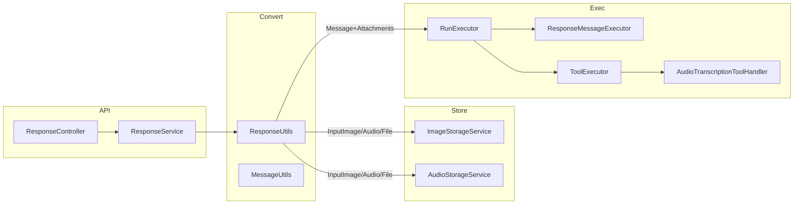
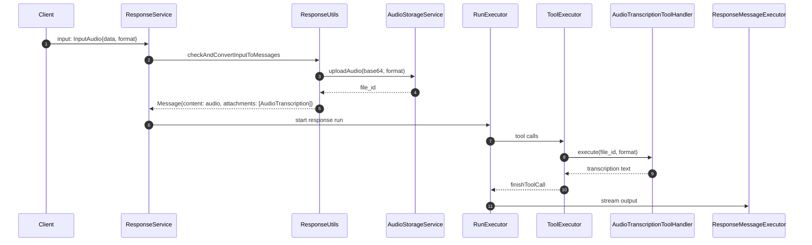

# 多模态：文件与音频输入的支持

> 通过统一的输入建模、附件（Attachment）与工具（Tool）协同机制，系统在不改变运行主干（Run/Plan/Tool/State/Context）的前提下，为图片、文件与音频等多模态输入提供“可存储/非存储、可流式、可工具联动”的完整支持。

---

## 设计目标

- **统一抽象**：以 `ConversationItem/Input*` 为入口，落地为 `Message` 的 `content/attachments/metadata`。入口统一，内部复用。
- **工具协同**：输入即附带可用工具（例如：音频→转写工具、文件→检索/读文件工具），由 `Planner/ToolExecutor` 无缝触发。
- **端到端流式**：保持 Responses/Assistants 的 SSE 输出序列，图片与音频以文本占位描述或事件方式输出。
- **Non-Store 兼容**：在 `store=false` 时尽量避免外部持久化，走内存或直传策略。

---

## 架构总览



- **入口**：`ResponseController.createResponses()` → `ResponseService.createResponse()`。
- **转换**：`ResponseUtils.checkAndConvertInputToMessages(...)` 将多模态输入转为 `Message` 列表（含 `content/attachments`）。
- **执行**：`RunExecutor` 复用执行主干；工具由 `ToolExecutor` 并发处理，输出串行化由 `ToolOutputChannel` 保证。

---

## 输入模型与落地映射

- 入口模型：`com.theokanning.openai.response.input.*`
  - 文本：`InputValue`/`InputText`
  - 图片：`InputImage(image_url | file_id)`
  - 文件：`InputFile(file_id)`
  - 音频：`InputAudio(input_audio{data, format})`

- 转换逻辑：`api/src/main/java/com/ke/assistant/util/ResponseUtils.java`
  - `checkAndConvertInputToMessages(...)`
  - `convertConversationItemsToMessages(...)`
  - `processInputMessage(...)`

- 产物：`com.theokanning.openai.assistants.message.Message`
  - `content`：`MessageContent` 列表（`text/image_url/image_file/audio/tool_call/tool_result`）
  - `attachments`：与文件/工具的关联，如 `Attachment(file_id, [Tool.Retrieval, Tool.ReadFiles])`、`Attachment(file_id, [Tool.AudioTranscription])`

---

## 图片与文件输入

- 图片 URL 或 Base64
  - 处理入口：`ResponseUtils.processInputMessage(InputImage ...)`
  - URL 场景：直接作为 `image_url` 写入 `MessageContent`。
  - Base64 场景：`ImageStorageService.processImageUrl(...)`
    - Store 模式：解析并上传至 S3，返回可访问 URL
      - 代码：`api/src/main/java/com/ke/assistant/service/ImageStorageService.java`
    - Non-Store 模式：`RepoContext.isActive()` 时直接返回原始字符串，避免外部持久化
  - Chat 侧格式化：`MessageUtils.formatChatCompletionContent(...)` 将 `image_*` 转换为 `MultiMediaContent` 供模型视觉输入

- 文件（如 PDF/文档）
  - 处理入口：`ResponseUtils.processInputMessage(InputFile ...)`
  - 附件策略：追加 `Attachment(file_id, [Tool.Retrieval, Tool.ReadFiles])`
    - 使本次 Run 可使用“检索/读文件”相关工具访问该文件
  - 工具触发：由 LLM 选择，`ToolExecutor` 并发执行，`RunStateManager` 统一落库/收敛

---

## 音频输入与转写（STT）

- 输入结构：`InputAudio{ input_audio:{ data(base64), format } }`
- 上传与落地：
  - 处理入口：`ResponseUtils.processInputMessage(InputAudio ...)`
  - 上传：`AudioStorageService.uploadAudio(base64, format)` → 通过 `OpenAiServiceFactory.create().uploadFile("storage", ...)` 返回 `file_id`
    - 代码：`api/src/main/java/com/ke/assistant/service/AudioStorageService.java`
  - 写入消息：在 `Message.content` 增加 `type="audio"` 的 `audio_data{ file_id, format }`，并在 `attachments` 追加 `Attachment(file_id, [Tool.AudioTranscription])`

- 聊天侧格式化：
  - `MessageUtils.formatChatCompletionContent(...)` 使用 `templates/audio_transcription.pebble` 生成可读描述，作为文本片段供模型“看见”音频元信息
  - 模板：`api/src/main/resources/templates/audio_transcription.pebble`

- 工具执行（转写）：
  - 处理器：`api/src/main/java/com/ke/assistant/core/tools/handlers/AudioTranscriptionToolHandler.java`
    - 入参：`file_id`、`format`
    - 流程：根据 `file_id` 下载到临时文件 → `CreateTranscriptionRequest`（`ToolProperties.audioTranscription.model`）→ 返回文本转写
    - 配置：`api/src/main/java/com/ke/assistant/configuration/ToolProperties.java#AudioTranscriptionToolProperties`
  - 并发与输出：由 `ToolExecutor` 调度并发执行；输出通过 `ToolOutputChannel` 串行注入当前消息；Responses 路径由 `ResponseMessageExecutor` 转为 `Output*` 事件序列



---

## Non-Store 模式的差异点

- 图片 Base64：`ImageStorageService` 在 `RepoContext.isActive()` 时跳过上传，直接使用原始字符串，避免持久化。
- 音频 Base64：当前实现总是上传至 `file-api(storage)` 后返回 `file_id`；如需完全内存模式，可引入与图片相同的 Non-Store 分支（可在 `AudioStorageService` 增加 `RepoContext` 判定与直传策略）。
- 其余执行主干完全一致：同样复用 `RunExecutor/ToolExecutor/ResponseMessageExecutor` 与状态机。

---

## API 示例（Responses）

- 混合输入（文本+图片+文件+音频）：
```json
POST /v1/responses
{
  "model": "gpt-4o",
  "store": true,
  "stream": true,
  "input": {
    "type": "input_text",
    "text": "请根据图像和音频内容给出总结，并阅读附件PDF。"
  },
  "conversation": "thread_abc",
  "instructions": "请审慎调用必要的工具。",
  "tools": [],
  "additional_messages": [
    {
      "role": "user",
      "content": [
        {"type": "image_url", "image_url": {"url": "data:image/png;base64,....", "detail": "high"}},
        {"type": "input_file", "file_id": "file_xxx"},
        {"type": "input_audio", "input_audio": {"data": "<base64>", "format": "wav"}}
      ]
    }
  ]
}
```

---

## 关键代码索引

- 转换与格式化
  - `util/ResponseUtils.java`（`processInputMessage/convertConversationItemsToMessages`）
  - `util/MessageUtils.java`（`formatChatCompletionContent`，多模态转 `MultiMediaContent`）
  - 模板：`src/main/resources/templates/audio_transcription.pebble`
- 存储与上传
  - `service/ImageStorageService.java`（Base64→S3 / Non-Store直传）
  - `service/AudioStorageService.java`（Base64→file-api/storage）
- 工具与执行
  - `core/tools/handlers/AudioTranscriptionToolHandler.java`
  - `configuration/ToolProperties.java#AudioTranscriptionToolProperties`
  - `core/tools/ToolExecutor.java`、`core/tools/ToolOutputChannel.java`
  - `core/run/ResponseMessageExecutor.java`

---

## 小结

- 多模态输入在入口统一为会话消息与附件，再通过工具系统完成“读/检索/转写”等能力扩展。
- Non-Store 模式可避免外部持久化（图片已内建，音频可按需扩展），同时完整复用执行与流式协议。
- 该设计将“输入介质差异”隔离在转换与模板层，使 Run/Tool/State 的主流程保持稳定与简洁。
