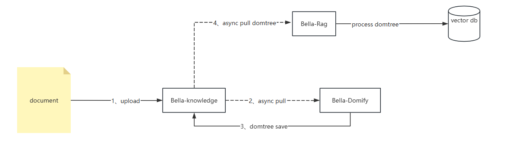

# 服务化启动（与知识库、知识检索增强组合）
## 系统要求
- Python >= 3.9
- 其他依赖项（详见requirements.txt）

以服务形式启动不依赖贝壳OpenAI开源体系，但文档解析流程依赖贝壳开源的（上传的文件是数据来源）,文件数据扭转如下


## 环境配置

需要设置以下环境变量：
- OPENAI_API_KEY：用于调用OpenAI API的密钥
- OPENAI_BASE_URL：OpenAI API的基础URL
- OPENAPI_CONSOLE_KEY：需要调用OpenAI console类接口获得元信息时候默认的全局key，目前主要用来获取视觉模型列表，用户可自行实现`VisionModelProvider`返回支持视觉的模型列表

### 服务化运行

1. 从Git下载代码

2. 启动命令

   ```bash
   uvicorn server.app:app --port 8080 --host 0.0.0.0
   ```

*也可以根据自身需要打包成docker镜像

