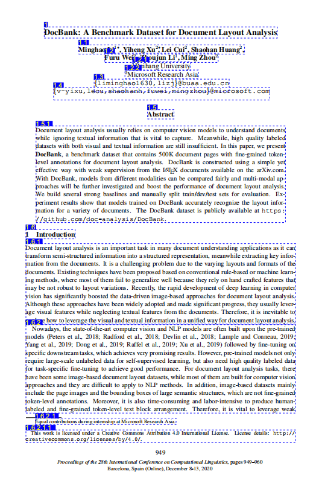

# Bella Domify
一个贝壳开源的文档解析Python库。使用Python lib包形式引入，也可以服务化方式运行，支持多种文档格式的解析和转换。

## 功能特点

### 支持多种文件格式
- PDF
- Word文档 (DOCX/DOC)
- Excel表格 (XLSX/XLS)
- CSV文件
- PowerPoint演示文稿 (PPTX)
- 文本文件
- 图片文件

### 解析功能
- **版面解析 (Layout Parse)**：提取文档的基本布局结构，包括文本块和图片块
- **DOM树解析 (DomTree Parse)**：构建详细的文档对象模型，便于进一步处理和分析
- **Markdown转换**：将解析结果转换为Markdown格式

### 高级功能
- **图像处理**：内置使用大模型ORC能力提取图像信息功能
- **表格处理**：解析表格结构和内容
- **页眉页脚识别**：自动识别和过滤页眉页脚
- **多进程解析**：使用多进程并行处理提高解析效率
- **评测标注功能**：内含评测模块，可标注PDF解析详情
  

## 优势
从下图效果测评数据可以看出贝壳自研的解析能力很强，正确率更高（基于贝壳有限测评集）

## 致谢

本项目基于 [pdf2docx](https://github.com/dothinking/pdf2docx) 进行二次开发，感谢原作者及其团队的杰出贡献。pdf2docx 是基于 PyMuPDF 提取文本、图片、矢量等原始数据。并基于规则解析章节、段落、表格、图片、文本等布局及样式等，具体功能可访问其GitHub地址。为我们的文档解析功能提供了重要的技术基础。

## 更多文章

[PDF解析： 视觉到结构的重建之旅](./assets/share.pdf)
