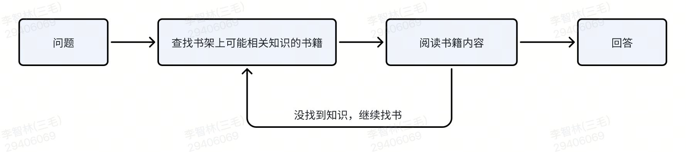
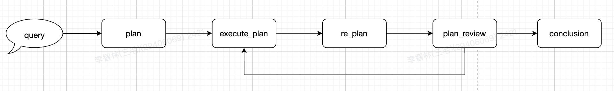
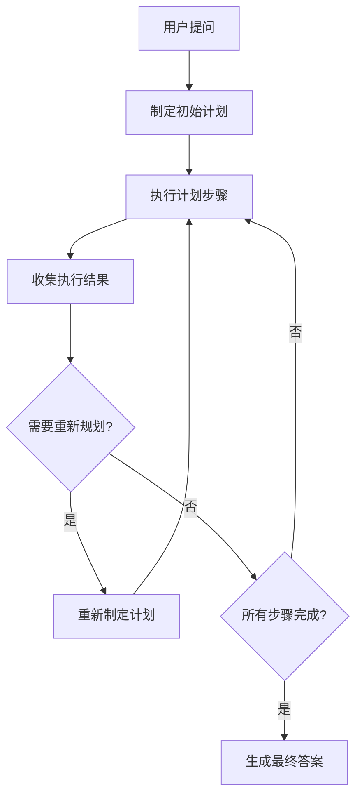

# Deep RAG - 智能Agent模式

Deep RAG是Bella-RAG系统的核心创新功能，基于Planning and Solve模式实现的智能agent，模拟人类在书架上查找答案的方式，提供比传统RAG更优的问答效果。

## 💡 什么是Deep RAG

### 核心理念

随着大语言模型能力的不断提升和上下文窗口的扩大，我们设计了一种让模型模拟人在书架上查找答案的方式，实现deep search模式的RAG。


**核心思路**：
1. **圈定文件范围** - 像人类一样先确定可能包含答案的文档
2. **阅读文档内容** - 深度阅读相关文档的完整内容  
3. **反思验证** - 对搜索和阅读结果进行反思验证
4. **动态调整** - 根据执行结果动态调整后续计划

### 传统RAG vs Deep RAG

| 对比维度 | 传统RAG            | Deep RAG           |
|---------|------------------|--------------------|
| **检索方式** | 基于embedding的片段检索 | 基于文档级别的智能搜索        |
| **内容理解** | 依赖切片，可能破坏文档结构    | 阅读完整文档，保持原始结构      |
| **推理能力** | 单步检索生成           | 多步骤规划和执行           |
| **准确率** | 72%+             | 84%+（相比传统模式提升12pp） |
| **适用场景** | 简单问答             | 复杂问题分析和推理          |

## 🔧 核心工具

Deep RAG封装了两个核心工具来实现智能搜索：

### 1. file_search工具
- **功能**: 根据用户提问查询相关文件列表
- **实现方式**: 结合文件摘要和检索技术，智能圈定相关文件范围
- **优化**: 支持分页查询，避免信息过载

```json
{
    "name": "file_search",
    "purpose": "查询与用户提问相关的文件列表，并返回文件内与提问相关的内容片段，可翻页查询",
    "input_schema": {
        "type": "object",
        "properties": {
            "question": {
                "type": "string",
                "description": "用户提问"
            },
            "page": {
                "type": "integer", 
                "description": "分页检索序号（从1开始）"
            }
        }
    }
}
```

### 2. read_file工具
- **功能**: 根据文件ID读取完整文档内容
- **实现方式**: 读取文件流并转换为模型友好的markdown格式
- **优势**: 保持文档原始结构，提供完整上下文

```json
{
    "name": "read_file", 
    "purpose": "读取指定文件的详细内容",
    "input_schema": {
        "type": "object",
        "properties": {
            "file_id": {
                "type": "string",
                "description": "通过file_search获取的文件标识"
            }
        }
    }
}
```

## 🏗️ Planning and Solve模式

### 架构优势

Deep RAG采用Planning and Solve执行模式，具有以下优势：

- **灵活性强**: re-planning机制可以满足react模式的查漏补缺，还可以跳过无用步骤，节省开销
- **通用性**: 整体planning prompt比较宏观，基本填入工具列表即可实现deep rag或者实现其他的agent
- **效果**: re-planning机制天然的实现了多重反思，适用复杂的任务

### 执行流程



### 五个核心阶段

1. **plan(query) → plan**
   - 指定一个初始的执行计划，根据当前装载的工具及用户提问

2. **execute_plan(plan) → plan, steps**  
   - 按照计划及用户的提问准备工具参数，执行当前依赖已完成的计划
   - 执行结果加载到memory

3. **replan(plan, query, steps) → plan**
   - 重新制定计划
   - 如果当前执行完已经能回答了，后续计划可以标记跳过
   - 如果当前计划不满足要求，继续视情况添加步骤

4. **plan_review(old_plan, new_plan) → bool**
   - 如果所有计划执行完成，则任务结束

5. **conclusion(plan, memory) → str**
   - 根据执行步骤和memory生成回答

## 🚀 优化机制

### 反思机制（Reflection）

为了提高执行准确性，Deep RAG引入了反思机制：

- **文件搜索反思**: 从search到的相关文件里，由语义理解能力较强的模型，选取最接近的文件
- **文件阅读反思**: 对文档的读取内容，由语义理解能力较强的模型判断是否相关


## 📊 性能表现

### 效果对比

基于实际测试数据，Deep RAG相比传统检索模式有显著提升：

| 指标 | 传统RAG | Deep RAG | 提升幅度 |
|------|---------|----------|----------|
| **回答准确率** | 85% | 97% | +12pp |
| **复杂问题处理** | 良好 | 优秀 | 显著提升 |

### 适用场景

- ✅ **复杂问题分析**: 需要多步骤推理的问题
- ✅ **跨文档信息整合**: 需要从多个文档中提取信息
- ✅ **深度内容理解**: 需要理解文档完整上下文
- ✅ **专业领域问答**: 需要准确理解专业术语和概念

### 注意事项

- ⚠️ **执行时间**: 相比传统模式耗时更长，适合对准确性要求高的场景
- ⚠️ **资源消耗**: 需要更多的模型调用和计算资源
- ⚠️ **模型依赖**: 效果与底层大语言模型能力强相关

## 🔗 使用方法

要使用Deep RAG模式，只需在API调用时设置mode参数：

```bash
curl --location 'http://localhost:8008/api/rag/chat' \
  --header 'Authorization: Bearer {OPEN_API_KEY}' \
  --header 'Content-Type: application/json' \
  --data '{
    "query": "复杂问题描述",
    "scope": [{"type": "file", "ids": ["file_123"]}],
    "user": "user_00000000", 
    "response_type": "stream",
    "mode": "deep"
  }'
```

详细的API使用说明请参考[API接口文档](./api.md)。

