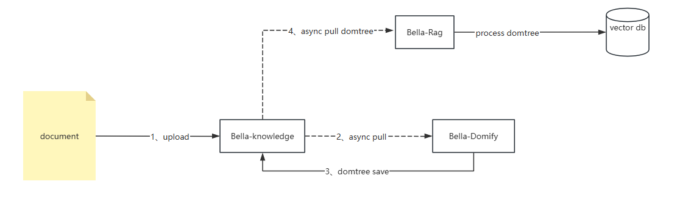

# Service Startup (Integration with Knowledge Base and Knowledge Retrieval Enhancement)
## System Requirements
- Python >= 3.9
- Other dependencies (see requirements.txt for details)

Starting as a service does not depend on the Lianjia OpenAI open-source ecosystem, but the document parsing process depends on Lianjia's open-source system (uploaded files are the data source). The file data transformation is as follows:


## Environment Configuration

The following environment variables need to be set:
- OPENAI_API_KEY: API key for calling OpenAI API
- OPENAI_BASE_URL: Base URL for OpenAI API
- OPENAPI_CONSOLE_KEY: Default global key needed when calling OpenAI console-type interfaces to obtain metadata, currently mainly used to get vision model lists. Users can implement their own `VisionModelProvider` to return a list of vision-supported models

### Service Mode Operation

1. Download code from Git

2. Startup command

   ```bash
   uvicorn server.app:app --port 8080 --host 0.0.0.0
   ```

*You can also package it into a Docker image according to your needs