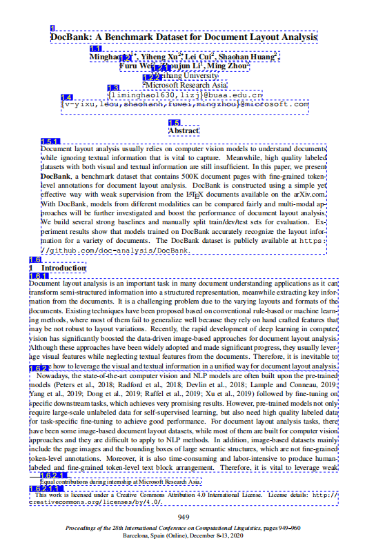
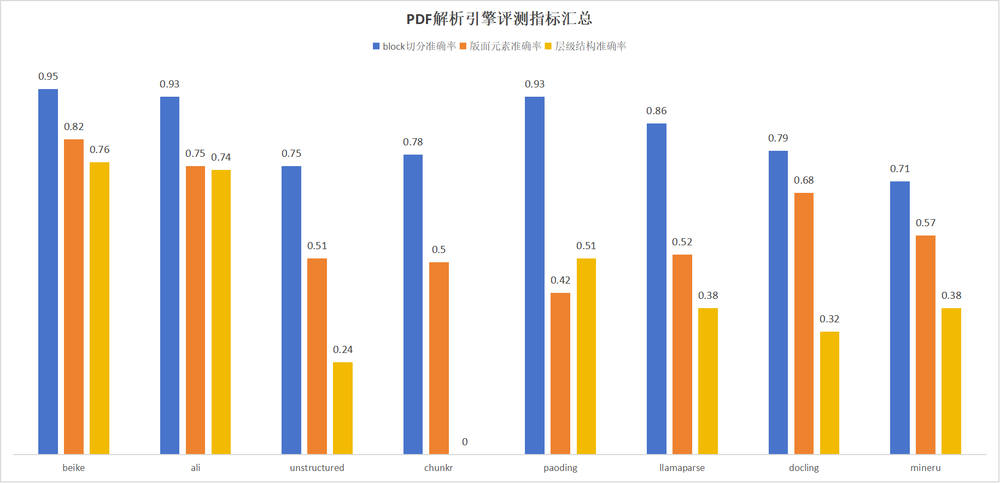

# Bella Domify
An open-source document parsing Python library from Lianjia Tech. It can be imported as a Python library package or run as a service, supporting parsing and conversion of multiple document formats.

## Features

### Supported File Formats
- PDF
- Word Documents (DOCX/DOC)
- Excel Spreadsheets (XLSX/XLS)
- CSV Files
- PowerPoint Presentations (PPTX)
- Text Files
- Image Files

### Parsing Capabilities
- **Layout Parse**: Extracts basic layout structure of documents, including text blocks and image blocks
- **DomTree Parse**: Builds detailed document object model for further processing and analysis
- **Markdown Conversion**: Converts parsing results to Markdown format

### Advanced Features
- **Image Processing**: Built-in OCR capabilities using large models to extract image information
- **Table Processing**: Parses table structure and content
- **Header/Footer Recognition**: Automatically identifies and filters headers and footers
- **Multi-process Parsing**: Uses multi-process parallel processing to improve parsing efficiency
- **Evaluation and Annotation**: Built-in evaluation module for annotating PDF parsing details
  

## Advantages
From the evaluation data shown below, Lianjia's self-developed parsing capabilities are very strong with higher accuracy rates (based on Lianjia's limited test set)

## Acknowledgments

This project is based on secondary development of [pdf2docx](https://github.com/dothinking/pdf2docx). We thank the original authors and their team for their outstanding contributions. pdf2docx extracts raw data such as text, images, and vectors based on PyMuPDF, and parses layout and styles of sections, paragraphs, tables, images, text, etc. based on rules. For specific features, please visit its GitHub address. It provides an important technical foundation for our document parsing functionality.

## More Articles

[PDF Parsing: A Journey from Vision to Structure Reconstruction](./assets/share.pdf)